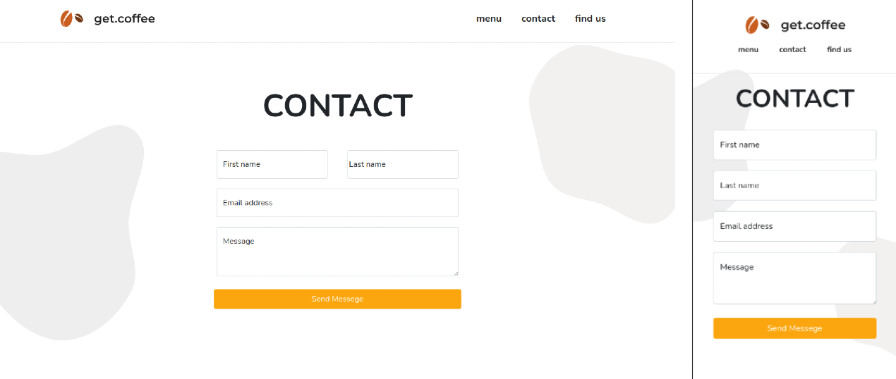

<h1 align="center">GET COFFEE - LANDING PAGE</h1>
<h3 align="center">Landing page de uma Cafeteria online</h3>
 
 
 

<legend>Página inicial</legend>
 
 

O projeto foi desenvolvido a partir de um desafio visto no Dev Challenge: https://devchallenge.com.br/challenges/5f94dfc04b6510002196cb1d/details. O desafio era criar uma landing page para uma cafeteria online fictícia, seguindo o modelo de referência dada.

O desafio era fazer a tela inicial, porém ficava livre se quisesse fazer as outras páginas (menu, contact e find us), e como eu queria aperfeiçoar meus conhecimentos de HTML e CSS, acabei desenvolvendo as outras páginas dessa LP também.

 

  <legend>Página Menu - Cardápio  </legend>
 
 
 
 

  <legend>Página Contato - Formulário  </legend>
 
 
 
 

  <legend>Página Localização - Mapa  </legend>
 
 
 
 
